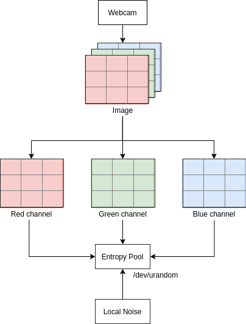

# About This Project
---
Inspired by Cloudflare's [LavaRand](https://blog.cloudflare.com/lavarand-in-production-the-nitty-gritty-technical-details/), this project is a conceptual implementation of how to stream an image data taken from a webcam to feed the system entropy pool (*/dev/urandom*). The goal of this project is to flood the entropy pool with more random data which can be used for cryptographycally secure random number generator. **Keep in mind that since this is just a conceptual, the implementation itself might be imperfect and inefficient.**

The project consists of 3 programs:
- `stream`: The main program which streams image data captured from the webcam into */dev/urandom* entropy pool
- `encryption`: Example of how you might use the entropy pool for encryption process
- `decryption`: Example of how you might use the entropy pool for decryption process

# How Does It Work?
---
To make this work, a webcam is required to capture an image of external environment. The captured image will be read as a multichannel matrix which represents pixel values in every color channels (red, green, blue). Let's say that the matrix is called an "image matrix". The next step is to split the channels within the image matrix into individual matrix and stream the value concurrently into the entropy pool. The purpose of this concurrent streaming is to take advantage of race condition, thus add more chaotic factor to the entropy pool.

Below is the diagram which represents the flow of the stream process.

# Dependency
---
This project uses Gocv to ease the webcam access and image processing operations, thus you are **required to install Gocv first** before running this project. The installation process could be found in its [github page](https://github.com/hybridgroup/gocv).